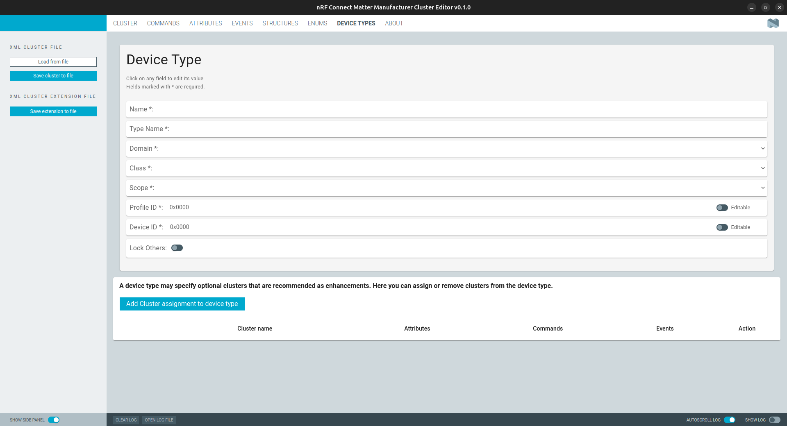

# nRF Connect Matter Manufacturer Cluster Editor

The Matter data model defines clusters that are common for all manufacturers and
can be used as a base for devices. Sometimes, it is necessary to create a new
cluster for a specific device, or extend an existing cluster to add new
attributes, commands, or events that are specific to the device. This tool
allows you to perform such operations using a graphical user interface. If the
desired device type is not listed in the Matter Device Type Library
specification, you can use the tool to create a new one, and include it in the
project.

## Requirements

-   `npm` in version at least `10.9.2`.
-   `node.js` in version at least `22.13.0`.

## Installation

The nRF Connect Matter Manufacturer Cluster Editor application is installed from
nRF Connect for Desktop. For detailed steps, see
[Installing nRF Connect for Desktop apps](https://docs.nordicsemi.com/bundle/nrf-connect-desktop/page/installing_apps.html)
in the nRF Connect for Desktop documentation.

## Documentation

See the
[nRF Connect Matter Manufacturer Cluster Editor tool](https://docs.nordicsemi.com/bundle/ncs-latest/page/nrf/protocols/matter/getting_started/manufacturer_cluster_editor_tool.html)
user guide in the nRF Connect SDK documentation to learn about the tool usage.

To learn how to use the editor in practice, see the
[Creating manufacturer-specific clusters in Matter application](https://docs.nordicsemi.com/bundle/ncs-latest/page/nrf/protocols/matter/getting_started/custom_clusters.html)
user guide in the nRF Connect SDK documentation.

## Development

See the
[app development](https://nordicsemiconductor.github.io/pc-nrfconnect-docs/)
pages for details on how to develop apps for the nRF Connect for Desktop
framework.

## Feedback

Please report issues on the [DevZone](https://devzone.nordicsemi.com) portal.

## Contributing

See the
[infos on contributing](https://nordicsemiconductor.github.io/pc-nrfconnect-docs/contributing)
for details.

## License

See the [LICENSE](LICENSE) file for details.
