# Overview and user interface

The {{app_name}} main window displays the basic information about the Matter cluster. The user interface broadly follows the organization of other nRF Connect for Desktop apps.

When you start the {{app_name}}, the application main window appears with the **Cluster** tab selected by default and its main panel empty.

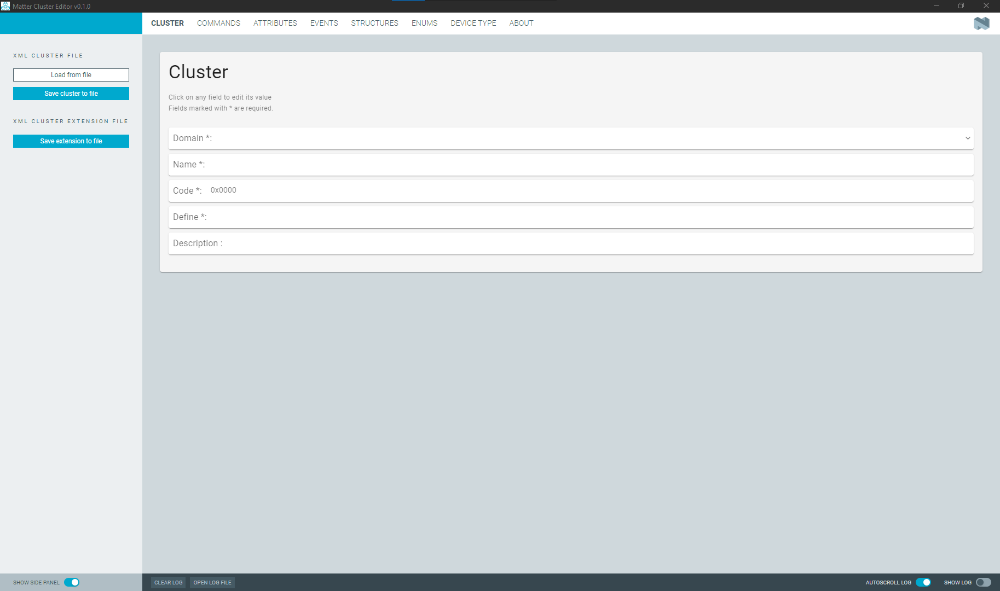

!!! info "Tip"
    You can learn about tool functionalities directly from the tool interface by hovering your mouse over elements to see dedicated tooltips with information about each element.

    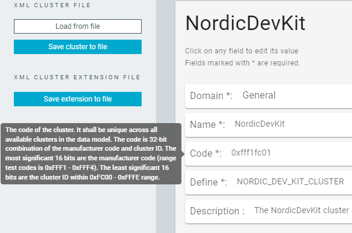

## Side panel sections

On the left side of the tool, the app includes several UI elements for managing Matter cluster files.

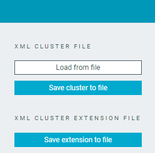

### XML Cluster File

The buttons in this section let you load Matter cluster XML files and save them.

| Button                   | Description                                                                                 |
|--------------------------|---------------------------------------------------------------------------------------------|
| **Load from file**       | Loads the cluster definition or cluster extension from an XML file.  Once you load a Matter cluster XML file, the [cluster name field](#cluster-name-field) above the XML Cluster File section changes to the name of the loaded cluster and all tabs are populated with the data from the loaded cluster.                           |
| **Save cluster to file** | Saves the current cluster definition to an XML file.  This option is only available for new clusters.  The name should be unique across all available clusters in the Matter Data Model.  |

### XML Cluster Extension File

This tab includes the **Save extension to file** button, which checks the difference between the current filled-in values and the loaded cluster and saves the difference to an XML file.

The {{app_name}} automatically compares your current cluster with the originally loaded cluster and saves only the differences as an extension file. This means the following:

- Only newly added elements are included in the extension.
- Modified elements are included with their new values.
- Unchanged elements are not included in the extension.

If there is no difference, the tool shows a notification indicating that there is no data to create a cluster extension, as in the following figure:

### Cluster name field

This is the blue area at the top of the side panel sections. When you load a Matter cluster XML file, the name of the cluster is displayed here (for example, `NordicDevKit` in the following image.)

!!! info "Tip"
    You can change the name of the cluster by clicking on the name bar and typing a new name. The new name must be unique across all available clusters in the Matter Data Model.

If the file contains more than one cluster, the tool shows a notification with the list of available clusters, as in the following image.

Selecting a cluster from the list loads the cluster definition or cluster extension.

## Main window

The main app window shows the information for the currently selected tab.

The following tabs are available:

- Commands - Lists all commands assigned to the cluster.
- Attributes - Shows all attributes associated with the cluster.
- Events - Displays all events defined for the cluster.
- Structures - Lists all structure types defined for the cluster.
- Enums - Contains all enumeration types used by the cluster.
- Device type - Provides the device type definition.
- About - Application information and settings.

!!! info "Tip"
    A number in the top-right corner of a button indicates the current number of elements in the list.
    You can click the button to access the list.
    For example, the number in the following image indicates there are two items in the **Accesses** list.

    

### Cluster tab

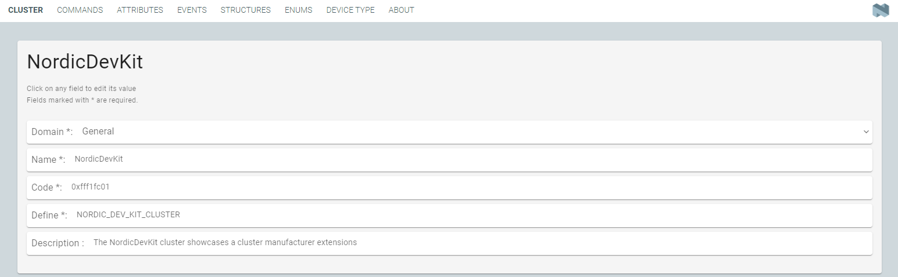

This tab contains input fields for information about the cluster.

|   Input field   |                                               Description                                                | Required |
| --------------- | -------------------------------------------------------------------------------------------------------- | -------- |
| **Domain**      | A combined text input and drop-down field for selecting from predefined domains. | Yes      |
| **Name**        | A text input field for the cluster name.                                         | Yes      |
| **Code**        | A text input field with default value "0x0000".                                  | Yes      |
| **Define**      | A text input field for the cluster definition.                                   | Yes      |
| **Description** | A text input area for an optional cluster description.                                                   | No       |

### Commands tab

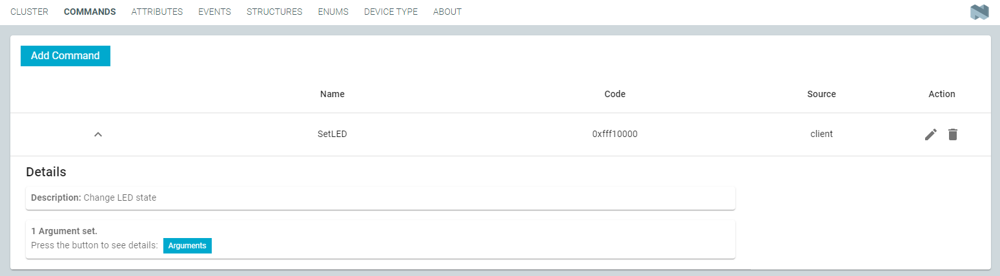

This tab lists all commands assigned to the cluster.

You can add new commands using the **Add Command** button.

|           UI element           |                              Description                              |
| ------------------------------ | --------------------------------------------------------------------- |
| **Name**                       | Command name.                                                         |
| **Code**                       | Command code.                                                         |
| **Source**                     | Source of the command.                                                |
| **Details**                    | List of complete command settings.  This list is initially hidden. Click the expand chevron to see the list.                                     |
| **Action: Edit** (pencil icon) | Edit the command. This opens the edit window that is described below. |
| **Action: Delete** (bin icon)  | Delete the command from the list.                                     |

#### Add Command

When you click the **Add Command** button, the edit box dialog appears.

|   UI element   |                                               Description                                                | Required |
| --------------- | -------------------------------------------------------------------------------------------------------- | -------- |
| **Name**      | A text input field for the command name.                                         | Yes      |
| **Code**      | A text input field for the command code.                                         | Yes      |
| **Source**  | Source of the command, either ``server`` or ``client``. | Yes      |
| **Response**  | Name of the command that is a response to the current command. Leave empty if no response is required.  | No       |
| **Optional**  | Toggle button to define the command as mandatory (toggle disabled) or optional (toggle enabled).  | No       |
| **Disable Default Response**  | Toggle button to disable the default response (toggle enabled) or have it enabled (toggle disabled). The setting is not taken into account if the **Response** field is empty.  | No       |
| **Description** | A text input area for an optional command description.                                                   | No       |
| **Arguments** | Add a new argument to the command. | No       |
| **Accesses** | Add a new access privilege to the command. | No       |

##### Arguments

You can add new arguments by clicking the **Arguments** button at the bottom of the edit window.
When you click this button, the arguments window appears, where you can click the **+** button to add new arguments to the list, like in the following image.

")

You can edit the following fields of the argument entry.

|   UI element   |                                               Description                                                | Required |
| --------------- | -------------------------------------------------------------------------------------------------------- | -------- |
| **Name**      | A text input field for the command name. The name must be unique within the command.                                         | Yes      |
| **Type**      | A combined text input and drop-down field for selecting the data type of the argument. The data type list is populated from the Matter Data Model template.                                         | Yes      |
| **Is Nullable**  | Toggle button to define whether the argument can be null (toggle enabled) or not (toggle disabled). | No       |
| **Optional**  | Toggle button to define the argument as mandatory (toggle disabled) or optional (toggle enabled).  | No       |
| **Delete** (bin icon)   | Delete the argument from the list.  | No       |

##### Accesses

You can add new access privileges by clicking the **Accesses** button at the bottom of the edit window.
When you click this button, the access privileges window appears, where you can click the **+** button to add new access privileges to the list, like in the following image.

")

You can edit the following fields of the access privilege entry.

|   UI element   |                                               Description                                                | Required |
| --------------- | -------------------------------------------------------------------------------------------------------- | -------- |
| **Op**      | A drop-down menu for selecting the operation type: `read`, `write`, or `invoke`.                                         | Yes      |
| **Role**      | A drop-down menu for selecing the role related to the operation type: `none`, `view`, `operate`, `manage`, `administer`.                                         | Yes      |
| **Delete** (bin icon)   | Delete the access privilege from the list.  | No       |

### Attributes tab

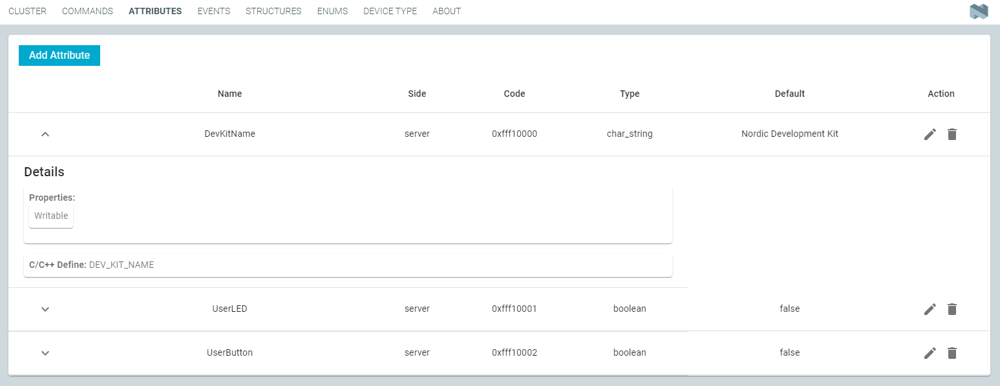

This tab lists all attributes associated with the cluster.

|           UI element           |                              Description                              |
| ------------------------------ | --------------------------------------------------------------------- |
| **Name**                       | Attribute name.                                                       |
| **Side**                       | Indicates whether the attribute is on the `server` or `client` side.  |
| **Code**                       | Attribute code.                                                       |
| **Type**                       | The data type of the attribute.                                       |
| **Default**                    | The default value for the attribute.                                  |
| **Details**                    | List of complete attribute settings.  This list is initially hidden. Click the expand chevron to see the list.                                     |
| **Action: Edit** (pencil icon) | Edit the attribute. This opens the edit window that is described below. |
| **Action: Delete** (bin icon)  | Delete the attribute from the list.                                    |

#### Add Attribute

You can add new attributes using the **Add Attribute** button.
When you click this button, the edit box dialog appears.

|   UI element   |                                               Description                                                | Required |
| --------------- | -------------------------------------------------------------------------------------------------------- | -------- |
| **Name**      | A text input field for the attribute name.                                       | Yes      |
| **Side**      | A drop-down menu for selecting `server` or `client`.                       | Yes      |
| **Code**      | A text input field for the attribute code.                                       | Yes      |
| **Define**    | A text input field for the attribute definition.                                 | Yes      |
| **Type**      | A combined text input and drop-down field for selecting the data type.                              | Yes      |
| **Length**      | A text input field for the attribute. length.                                                            | No       |
| **Min**         | A text input field for the minimum value of the attribute. Only valid for the numeric data types.                                                               | No       |
| **Max**         | A text input field for the maximum value of the attribute. Must be higher than **Min**. Only valid for the numeric data types.                                                               | No       |
| **Default**     | A text input field for the default value of the attribute. Must be the same as **Type**. | No       |
| **Api Maturity**| A drop-down menu for selecting the API maturity level: `provisional`, `internal`, `stable`, or `deprecated`. Arguments with no level selected are considered to be `stable`.                                                      | No       |
| **Writable**    | Toggle button to define the attribute as writable (toggle enabled) or read-only (toggle disabled).       | No       |
| **Reportable**  | Toggle button to define the attribute as reportable (toggle enabled) or not reportable (toggle disabled). | No       |
| **Is Nullable** | Toggle button to define whether the attribute can be null (toggle enabled) or not (toggle disabled).     | No       |
| **Optional**    | Toggle button to define the attribute as mandatory (toggle disabled) or optional (toggle enabled).       | No       |
| **Accesses**    | Add a new access privilege to the attribute.                                                            | No       |

##### Accesses

You can add new access privileges by clicking the **Accesses** button at the bottom of the edit window.
When you click this button, the access privileges window appears, where you can click the **+** button to add new access privileges to the list, like in the following image.

")

You can edit the following fields of the access privilege entry.

|   UI element    |                                               Description                                                | Required |
| --------------- | -------------------------------------------------------------------------------------------------------- | -------- |
| **Op**          | A drop-down menu for selecting the operation type: `read`, `write`, or `invoke`. | Yes      |
| **Role**        | A drop-down menu for selecing the role related to the operation type: `none`, `view`, `operate`, `manage`, `administer`. | Yes      |
| **Delete** (bin icon)   | Delete the access privilege from the list.  | No       |

### Events tab

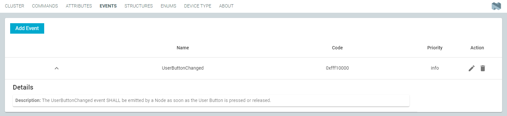

This tab lists all events defined for the cluster.

|           UI element           |                              Description                              |
| ------------------------------ | --------------------------------------------------------------------- |
| **Name**                       | Event name.                                                           |
| **Code**                       | Event code.                                                           |
| **Priority**                   | The priority level of the event.                                      |
| **Details**                    | List of complete event settings.  This list is initially hidden. Click the expand chevron to see the list.                                     |
| **Action: Edit** (pencil icon) | Edit the event. This opens the edit window that is described below.   |
| **Action: Delete** (bin icon)  | Delete the event from the list.                                       |

#### Add Event

You can add new events using the **Add Event** button.
When you click this button, the edit box dialog appears.

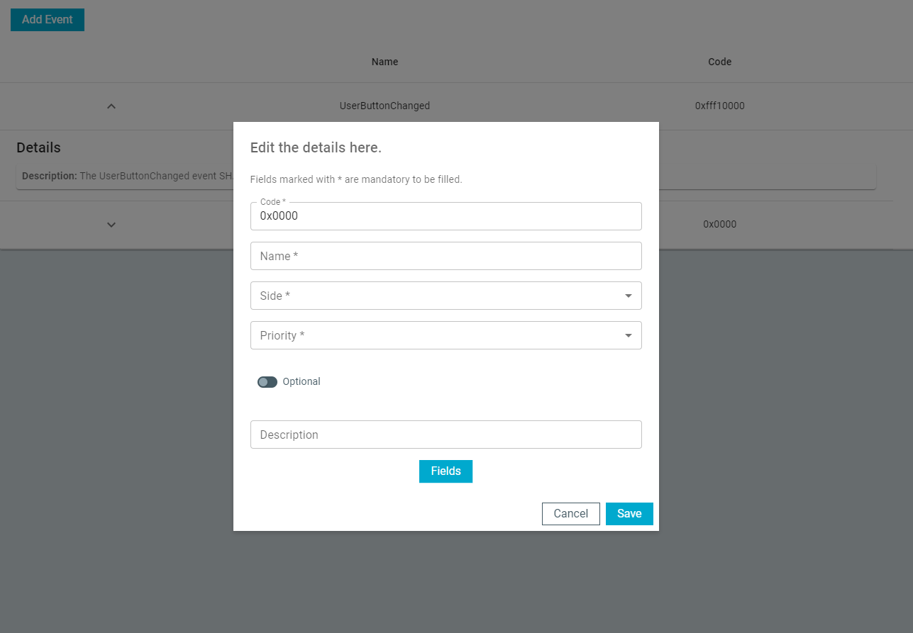

|   UI element    |                                                 Description                                                  | Required |
| --------------- | ------------------------------------------------------------------------------------------------------------ | -------- |
| **Code**        | A text input field for the event code.                                               | Yes      |
| **Name**        | A text input field for the event name.                                               | Yes      |
| **Side**        | A drop-down menu for selecting the source of the event, either `server` or `client`. | Yes      |
| **Priority**    | A drop-down menu for selecting the event priority level: `debug`, `info`, or `critical`.                     | No       |
| **Optional**    | Toggle button to define the event as mandatory (toggle disabled) or optional (toggle enabled).               | No       |
| **Description** | A text input area for an optional event description.                                                         | No       |
| **Fields**      | Add a new field to the event.                                                                                | No       |

##### Fields

You can add new fields by clicking the **Fields** button at the bottom of the edit window.
When you click this button, the fields window appears, where you can click the **+** button to add new fields to the list, like in the following image.

")

You can edit the following fields of the fields entry.

|   UI element   |                                               Description                                                | Required |
| --------------- | -------------------------------------------------------------------------------------------------------- | -------- |
| **Id**        | A text input field for the numeric identifier of the field. The identifier must be unique within the event. | Yes      |
| **Name**      | A text input field for the field name. The name must be unique within the event.                                         | Yes      |
| **Type**      | A combined text input and drop-down field for selecting the data type of the field. The data type list is populated from the Matter Data Model template.                                         | Yes      |
| **Delete** (bin icon)   | Delete the field from the list.  | No       |

### Structures tab

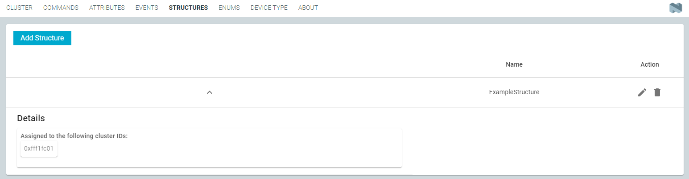

This tab lists all structure types defined for the cluster.

|           UI element           |                              Description                              |
| ------------------------------ | --------------------------------------------------------------------- |
| **Name**                       | Structure name.                                                       |
| **Details**                    | List of complete structure settings.  This list is initially hidden. Click the expand chevron to see the list.                                     |
| **Action: Edit** (pencil icon) | Edit the structure. This opens the edit window that is described below. |
| **Action: Delete** (bin icon)  | Delete the structure from the list.                                   |

#### Add Structure

You can add new structures using the **Add Structure** button.
When you click this button, the edit box dialog appears.

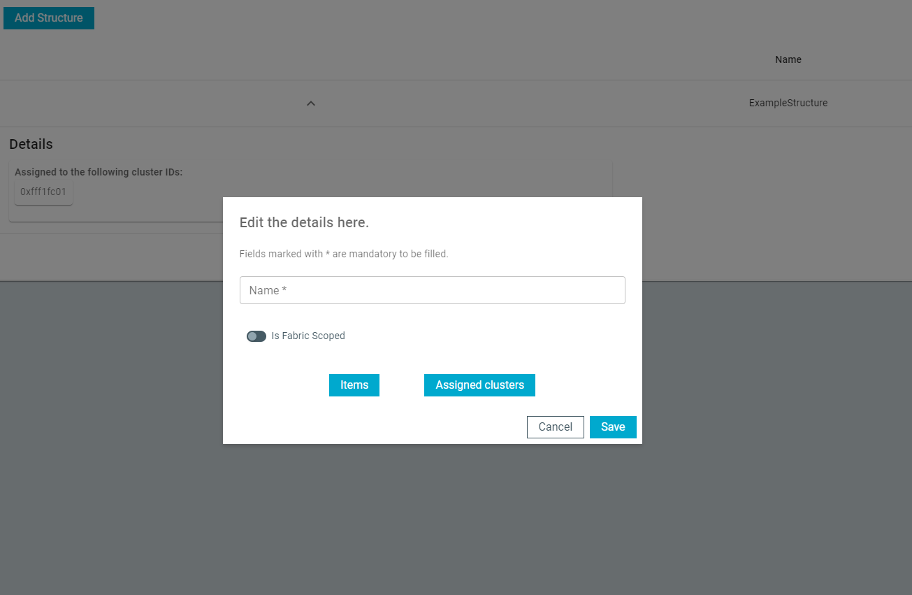

|      UI element       |                                                Description                                                 | Required |
| --------------------- | ---------------------------------------------------------------------------------------------------------- | -------- |
| **Name**              | A text input field for the structure name.                                         | Yes      |
| **Is Fabric Scoped**  | Toggle button to indicate whether the structure is fabric-scoped (toggle enabled) or not (toggle disabld). | No       |
| **Items**             | Add a new item to the structure.                                                                           | No       |
| **Assigned clusters** | Add a new cluster assignment to the structure.                                                             | No       |

##### Items

You can add new items by clicking the **Items** button at the bottom of the edit window.
When you click this button, the items window appears, where you can click the **+** button to add new items to the list, like in the following image.

")

You can edit the following fields of the items entry.

|   UI element   |                                               Description                                                | Required |
| --------------- | -------------------------------------------------------------------------------------------------------- | -------- |
| **Field Id**        | A text input field for the numeric identifier of the item. The identifier must be unique within the structure. | Yes      |
| **Name**      | A text input field for the item name. The name must be unique within the structure.                                         | Yes      |
| **Type**      | A combined text input and drop-down field for selecting the data type of the item. The data type list is populated from the Matter Data Model template.                                         | Yes      |
| **Length**   | Length of the item in bytes. Applies only to the `array` data type. Must be higher than **Min Length**.  | No       |
| **Min Length**   | Minimum allowed length of the item in bytes. Applies only to the `array` data type. | No       |
| **Min**   | The minimum allowed value of the item. Applies only to the numeric data types. The minimum value must be smaller than **Max** value and must fit in the numeric type bounds.  | No       |
| **Max**   | The maximum allowed value of the item. Applies only to the numeric data types. The maximum value must be greater than **Min** value and must fit in the numeric type bounds.  | No       |
| **Is Nullable** | Toggle button to define whether the item can be null (toggle enabled) or not (toggle disabled).     | No       |
| **Is Fabric Sensitive** | Toggle button to indicate whether the item is fabric-sensitive (toggle enabled) or not (toggle disabld).                                                     | No       |
| **Delete** (bin icon)   | Delete the item from the list.  | No       |

##### Assigned clusters

You can add new cluster assignments by clicking the **Assigned clusters** button at the bottom of the edit window.
When you click this button, the assigned clusters window appears, where you can click the **+** button to add new assigned clusters to the list, like in the following image.

")

You can edit the following fields of the assigned clusters entry.

|   UI element   |                                               Description                                                | Required |
| --------------- | -------------------------------------------------------------------------------------------------------- | -------- |
| **Code**      | A text input field for the code of the cluster that the struct is associated with. Must be empty if structure is global and not applicable to a specific cluster.                                         | Yes      |
| **Delete** (bin icon)   | Delete the cluster assignment from the list.  | No       |

### Enums tab

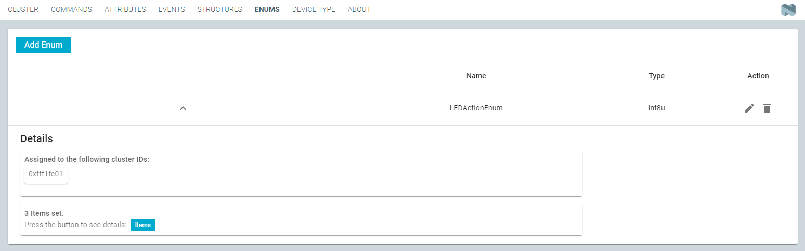

This tab contains all enumeration types used by the cluster.

You can add new enumerations using the **Add Enum** button.

|           UI element           |                              Description                              | Required |
| ------------------------------ | --------------------------------------------------------------------- | -------- |
| **Name**                       | A text input fiel for the name of the enumeration. Must be unique within the cluster.                                                     | Yes      |
| **Type**                       | A combined text input and drop-down field for selecting the data type of the enumeration.                                    | Yes      |
| **Details**                    | List of complete enumeration settings.  This list is initially hidden. Click the expand chevron to see the list.                                     | No       |
| **Action: Edit** (pencil icon) | Edit the enumeration. This opens the edit window that is described below. | No       |
| **Action: Delete** (bin icon)  | Delete the enumeration from the list.                                 | No       |

#### Add Enum

When you click the **Add Enum** button, the edit box dialog appears.

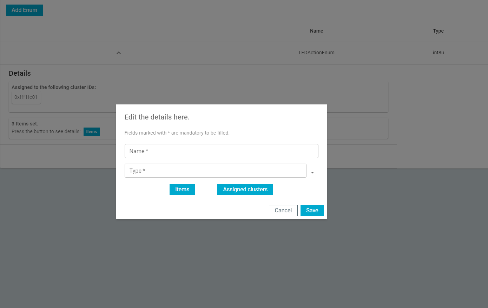

|   UI element   |                                               Description                                                | Required |
| --------------- | -------------------------------------------------------------------------------------------------------- | -------- |
| **Name**      | A text input field for the enum name. The name must be unique within the cluster.                                         | Yes      |
| **Type**      | A combined text input and drop-down field for selecting the data type of the enum. The data type list is populated from the Matter Data Model template.                                         | Yes      |
| **Items**      | Add a new item to the enumeration.                                                                       | No       |
| **Assigned clusters** | Add a new cluster assignment to the enumeration.                                               | No       |

##### Items

When you click the **Items** button, the items window appears, where you can click the **+** button to add new items to the list, like in the following image.

")

You can edit the following fields of the items entry.

|   UI element   |                                               Description                                                | Required |
| --------------- | -------------------------------------------------------------------------------------------------------- | -------- |
| **Name**      | A text input field for the item name. The name must be unique within the enum.                                         | Yes      |
| **Value**      | A text input field for the value assigned to the item. Must match the specified data type of the enumerated type.                                         | Yes      |
| **Delete** (bin icon)   | Delete the item from the list.  | No       |

##### Assigned clusters

When you click the **Assigned clusters** button, the assigned clusters window appears, where you can click the **+** button to add new assigned clusters to the list, like in the following image.

")

You can edit the following fields of the assigned clusters entry.

|   UI element   |                                               Description                                                | Required |
| --------------- | -------------------------------------------------------------------------------------------------------- | -------- |
| **Code**      | A text input field for the code of the cluster that the enum is associated with. Must be empty if structure is global and not applicable to a specific enum.                                         | Yes      |
| **Delete** (bin icon)   | Delete the cluster assignment from the list.  | No       |

### Device type tab

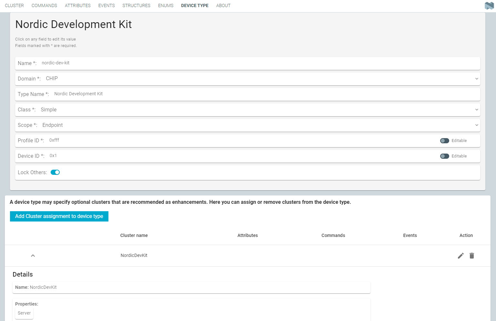

This tab contains fields for device type configuration and its cluster assignments.

#### Device type configuration fields

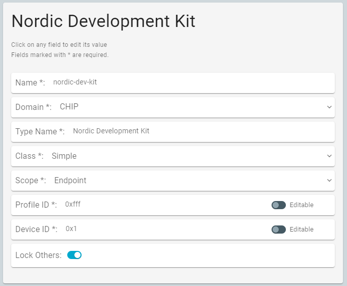

You can edit the following fields of the device type configuration.

|   UI element   |                                               Description                                                | Required |
| -------------- | -------------------------------------------------------------------------------------------------------- | -------- |
| **Name**        | A text input field for the unique identifier for the device type, formatted with dashes instead of spaces. | Yes      |
| **Domain**      | A combined text input and drop-down field for selecting from predefined domains. The domain categorizes the device type within a specific area of application, for example lighting, appliances, and so on. | Yes      |
| **Type Name**   | A text input field for a human-readable name that describes the device type. | Yes      |
| **Class**       | A drop-down input field for selecting the device class. If your device is a Utility, select `Utility`. If your device is an Application, select `Simple` or `Dynamic`. | Yes      |
| **Scope**       | A drop-down input field for selecting the device scope. Choose `Node` if the device is a Utility type scoped to a node. Choose `Endpoint` if the device represents the physical device or product. | Yes      |
| **Profile ID**  | A text input field for the profile ID with an editable flag. The profile ID reflects the current version of the Matter specification where the least significant byte is the major version and the most significant byte is the minor version. For example, the profile ID for Matter 1.4 is `0x0104`. | Yes      |
| **Device ID**   | A text input field for the device ID with an editable flag. A unique identifier for the device, essential for device recognition. A custom device ID must be unique and consist of the manufacturer code and device ID. | Yes      |
| **Lock Others** | A toggle button to lock the device to only use the defined clusters. If enabled, the device does not use other clusters than the ones defined below. This is useful to prevent the device from using other clusters that are not assigned to the device type. | No       |
| **Editable**    | A toggle button to define whether the device type can later be edited in ZAP tool. If enabled, the device type can be edited. | No       |

#### Device type cluster assignments

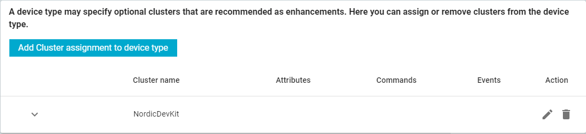

The table under the device type configuration lists all cluster assignments for the device type.
These assignments are optional, but are recommended as enhancements and will be automatically picked up by the ZAP tool.

You can add new cluster assignments to the device type by clicking the **Add Cluster assignment to device type** button above the list.

|   UI element   |                                               Description                                                |
| -------------- | -------------------------------------------------------------------------------------------------------- |
| **Cluster name** | The name of the cluster assigned to the device type.                                                    |
| **Attributes**   | The number of required attributes for this cluster assignment.                                          |
| **Commands**     | The number of required commands for this cluster assignment.                                            |
| **Events**       | The number of required events for this cluster assignment.                                              |
| **Action: Edit** (pencil icon) | Edit the cluster assignment. This opens the edit window that is described below. |
| **Action: Delete** (bin icon)  | Delete the cluster assignment from the list.                                                           |

##### Add Cluster assignment to device type

The following window opens when you click the **Add Cluster assignment to device type** button.

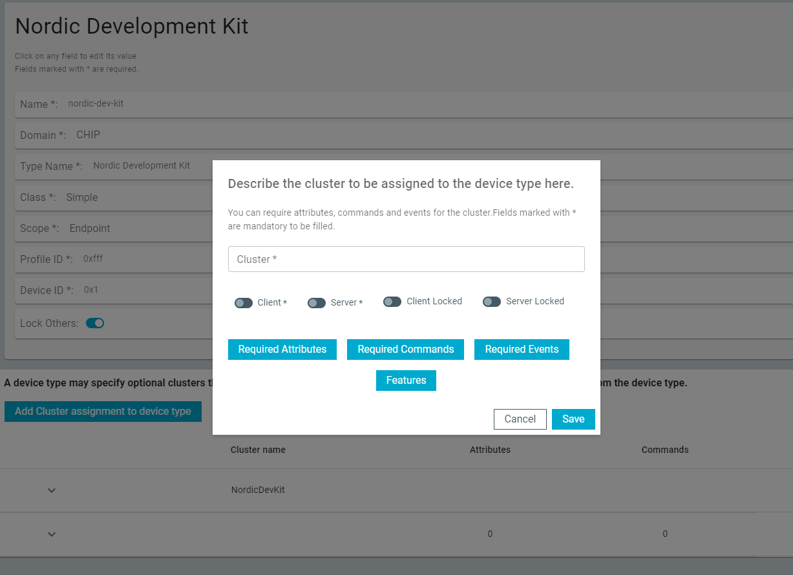

You can edit the following fields when adding a cluster assignment to device type.

|   UI element   |                                               Description                                                | Required |
| -------------- | -------------------------------------------------------------------------------------------------------- | -------- |
| **Cluster**      | A drop-down input field for selecting the cluster to be assigned to the device type. | Yes      |
| **Client**       | A toggle button to define whether the cluster uses the client role for attributes, commands, and events. If enabled, the cluster can be used as a client. | Yes      |
| **Server**       | A toggle button to define whether the cluster uses the server role for attributes, commands, and events. If enabled, the cluster can be used as a server. | Yes      |
| **Client Locked** | A toggle button to define whether the cluster should prevent using other attributes, commands, and events in client role than the ones assigned to the cluster. If enabled, the cluster can only use the attributes, commands, and events assigned to it.  | No       |
| **Server Locked** | A toggle button to define whether the cluster should prevent using other attributes, commands, and events in server role than the ones assigned to the cluster. If enabled, the cluster can only use the attributes, commands, and events assigned to it. | No       |
| **Required Attributes** | Add a new required attribute assignment to the device type. | No       |
| **Required Commands** | Add a new required command assignment to the device type. | No       |
| **Required Events** | Add a new required event assignment to the device type. | No       |
| **Features** | Add a new feature assignment to the device type. | No       |

###### Required Attributes

You can add new required attributes by clicking the **Required Attributes** button at the bottom of the edit window.
When you click this button, the required attributes window appears, where you can click the **+** button to add new required attributes to the list, like in the following image.

")

You can edit the following fields of the required attributes entry.

|      UI element       |                                       Description                                       |
| --------------------- | --------------------------------------------------------------------------------------- |
| **Name**              | A text input field for the exact name of the attribute that is required by the cluster. |
| **Delete** (bin icon) | Delete the attribute from the list.                                                     |

###### Required Commands

You can add new required commands by clicking the **Required Commands** button at the bottom of the edit window.
When you click this button, the required commands window appears, where you can click the **+** button to add new required commands to the list, like in the following image.

")

You can edit the following fields of the required commands entry.

|      UI element       |                                       Description                                       |
| --------------------- | --------------------------------------------------------------------------------------- |
| **Name**              | A text input field for the exact name of the command that is required by the cluster.   |
| **Delete** (bin icon) | Delete the command from the list.                                                       |

###### Required Events

You can add new required events by clicking the **Required Events** button at the bottom of the edit window.
When you click this button, the required events window appears, where you can click the **+** button to add new required events to the list, like in the following image.

")

You can edit the following fields of the required event entry.

|      UI element       |                                       Description                                       |
| --------------------- | --------------------------------------------------------------------------------------- |
| **Name**              | A text input field for the exact name of the event that is required by the cluster.     |
| **Delete** (bin icon) | Delete the event from the list.                                                         |

###### Features

You can add new features to the cluster assignment by clicking the **Features** button at the bottom of the edit window.
When you click this button, the features window appears, where you can click the **+** button to add new required features to the list, like in the following image.

")

You can edit the following fields of the feature entry.

|      UI element       |                                       Description                                       | Required |
| --------------------- | --------------------------------------------------------------------------------------- | -------- |
| **Code**              | A text input field for the code name of the feature. For example, `DL` for Door Lock. If no code name is available, use `00`. The code name must match the Matter Data Model or your custom cluster.     | Yes      |
| **Name**              | A text input field for the name of the feature.                 | Yes      |
| **Delete** (bin icon) | Delete the event from the list.                                                         | No       |

## About tab

Here you can view application information, restore settings to default, access source code, and documentation. You also can find information on the selected device, access support tools, and enable verbose logging.

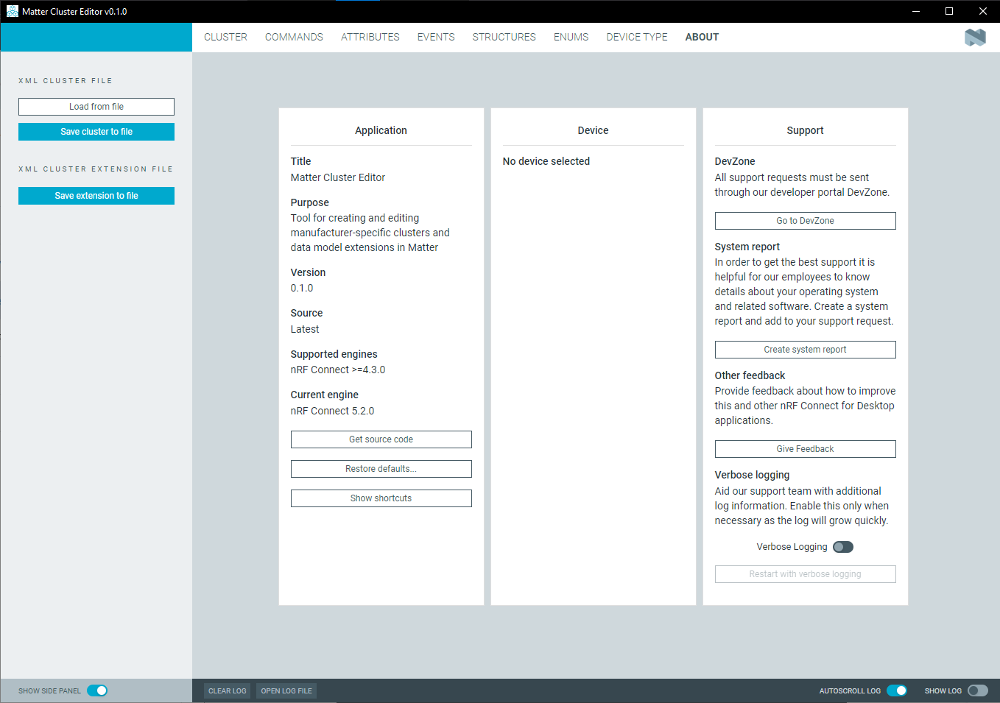

## Log

The Log panel allows you to view the most important log events, tagged with a timestamp.

Given that the {{app_name}} does not interact with any devices, it does not use the Log panel. For this reason, the panel is hidden by default (the **SHOW LOG** toggle is disabled).

## Notifications

The tool validates that all required fields are filled before saving. If required fields are not filled, you will see an error message when trying to save the element:

If there are no differences between the current cluster and the loaded cluster, the tool shows a message indicating no data to create an extension:

